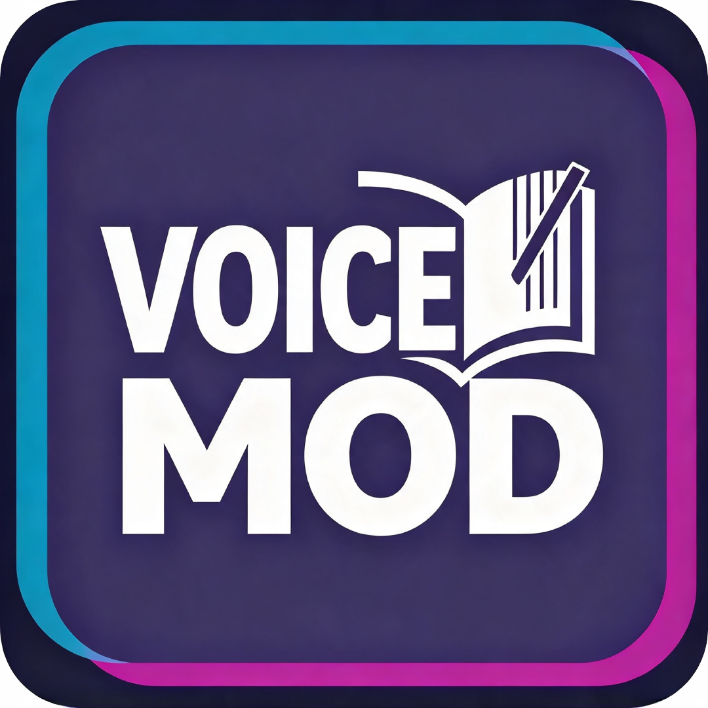

<div align="center">
  <a href="https://github.com/coonlink">
    
  </a>
  <h1>Chill with You : Lo-Fi Story — Мод «Русская озвучка»</h1>

[](README.md)
[](README.ru.md)


<!-- img alt="status" src="https://img.shields.io/badge/status-STABLE-green" style="margin: 0px 2px;" -->
</div>

<br />

<div align="center">
  <p>Заменяет <b>японскую озвучку</b> героини на русскую: 1319 реплик, текст взят из официальной русской локализации игры.</p>
</div>

## Требования

Чтобы озвучка заработала, нужно **всё** из списка:

1. Игра **Chill with You : Lo-Fi Story** (любая версия, Steam), запущенная один раз.
2. Файлы мода `voice_assets_all_32450596a5b4118c119776add9782a1f.bundle` и `catalog.json` (этот мод).
3. Больше ничего: ни BepInEx, ни плагинов, ни интернета не требуется.


## Скачать

Готовый к запуску zip выложен только в GitHub Releases:

👉 [github.com/crc137/Chill-With-You-Voice-Mod/releases](https://github.com/crc137/Chill-With-You-Voice-Mod/releases)

Берите `ChillWithYou-RussianVoice-v26.1.1-Linux-Windows.zip`. В архиве — два файла мода и
установщики для Windows и Linux, без сборки.


## Как установить (игроку, сборка не нужна)

**Вариант A — установщик в один клик (рекомендую)**

Положите `install.sh` / `install.bat`, `voice_assets_all_32450596a5b4118c119776add9782a1f.bundle` и `catalog.json` в одну папку и запустите установщик для своей ОС:

- **Windows:** двойной клик по `install.bat`
- **Linux / Steam Deck:** `./install.sh`

Установщик найдёт игру в **любой Steam-библиотеке** (включая нестандартные пути и внешние диски) и скопирует оба файла на место. Если игра не нашлась — спросит путь вручную. При первом запуске рядом с оригиналами остаются копии `.modbak`, чтобы откат работал без Steam.

**Вариант B — вручную**

1. Установите игру через Steam и **один раз** запустите её, чтобы создались папки.
2. Скопируйте **оба файла** из архива в папку игры и согласитесь на перезапись:
   ```
   Chill With You_Data/StreamingAssets/aa/StandaloneWindows64/voice_assets_all_32450596a5b4118c119776add9782a1f.bundle   ← сам мод
   Chill With You_Data/StreamingAssets/aa/catalog.json                                                            ← обязателен
   ```
3. Запустите игру.

`catalog.json` нужен обязательно: без него игра не загрузит бандл вообще, и озвучки не будет. В приложенном файле обнулено ровно одно поле — контрольная сумма бандла, остальное не тронуто.

## Если не работает
- **Полная тишина во всех репликах** → скорее всего не установлен или не перезаписан `catalog.json`. Бандл должен лежать в `.../aa/StandaloneWindows64/`, каталог — в `.../aa/`.
- **Часть реплик осталась на японском** → так и задумано: в официальной локализации нет текста примерно для 60 реплик (шуршание, короткие реакции вроде `~♪`).
- **Игра вылетает на старте** → верните оригиналы через `uninstall.sh` и проверьте целостность файлов в Steam.


## Удаление

```bash
./uninstall.sh
```

Или вручную: верните на место два оригинальных файла. Если оригиналов не осталось — Steam → ПКМ по игре → Свойства → Установленные файлы → Проверить целостность файлов; это вернёт бандл, а для `catalog.json` есть копия `.modbak`.


## Сборка

Сборки нет: мод — это готовые файлы, установщик просто копирует их в папку игры.
